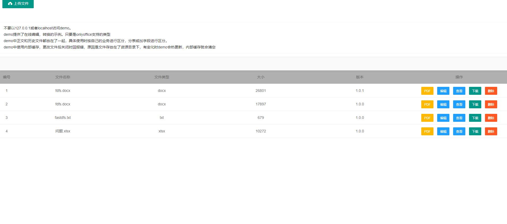
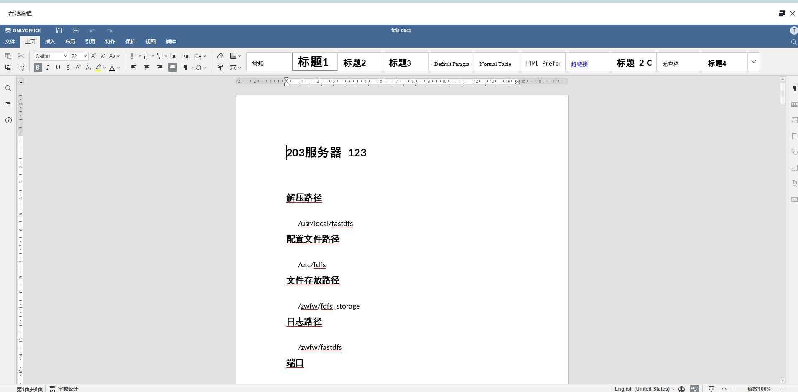
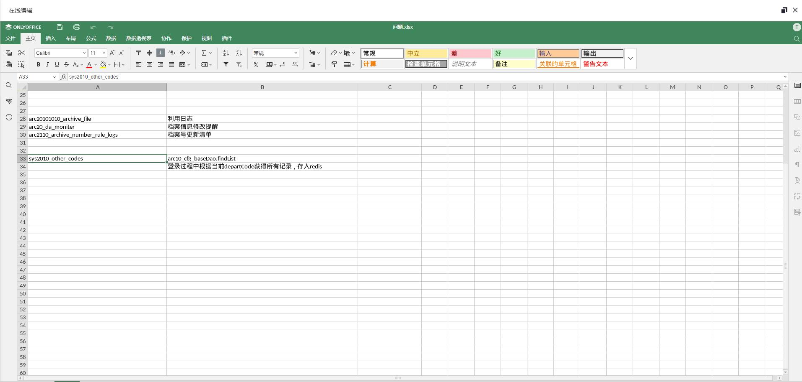
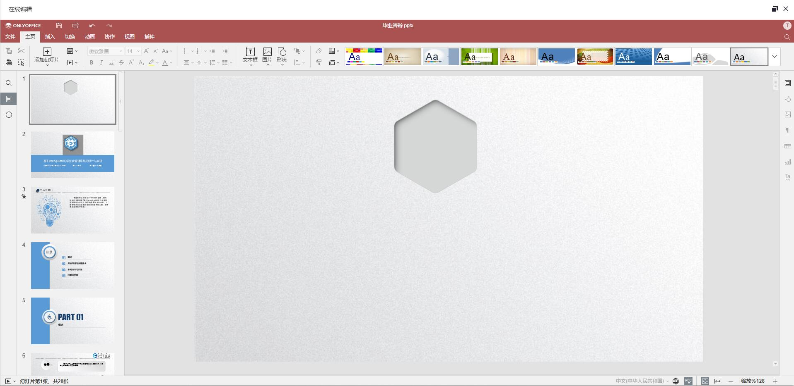
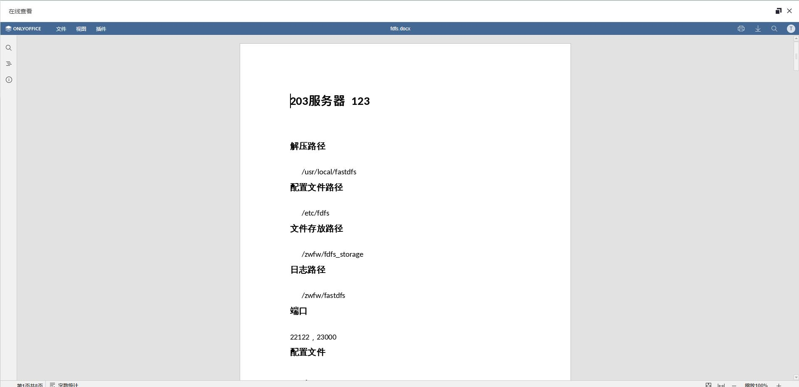
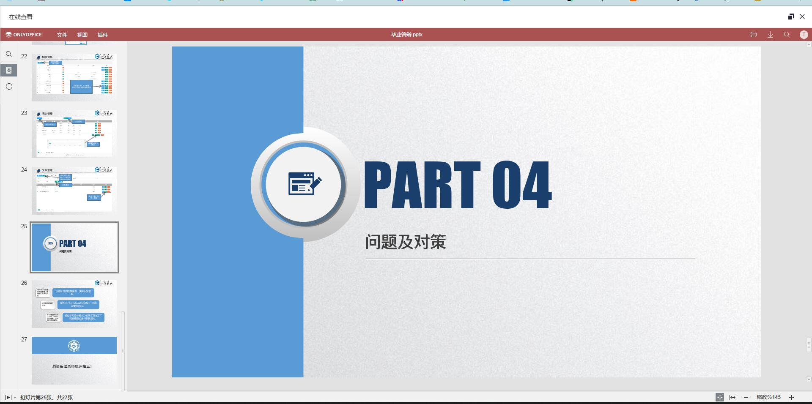
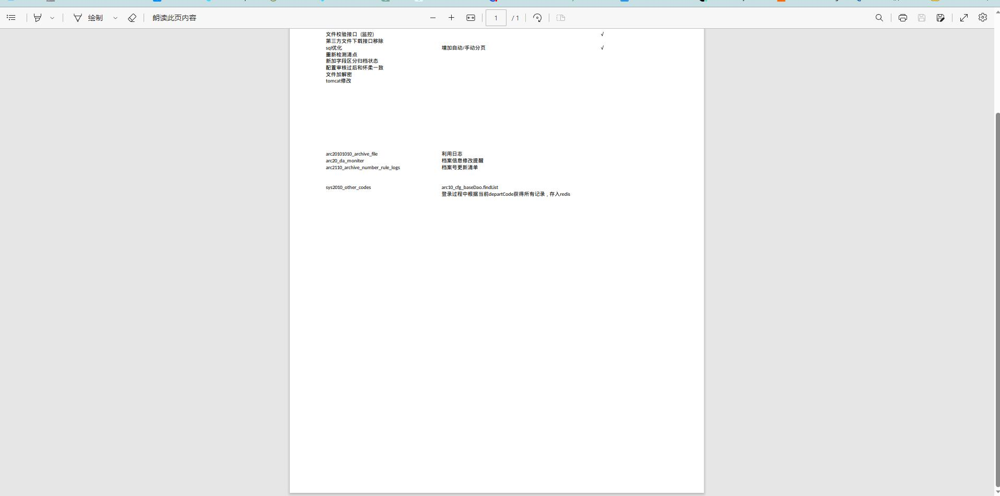
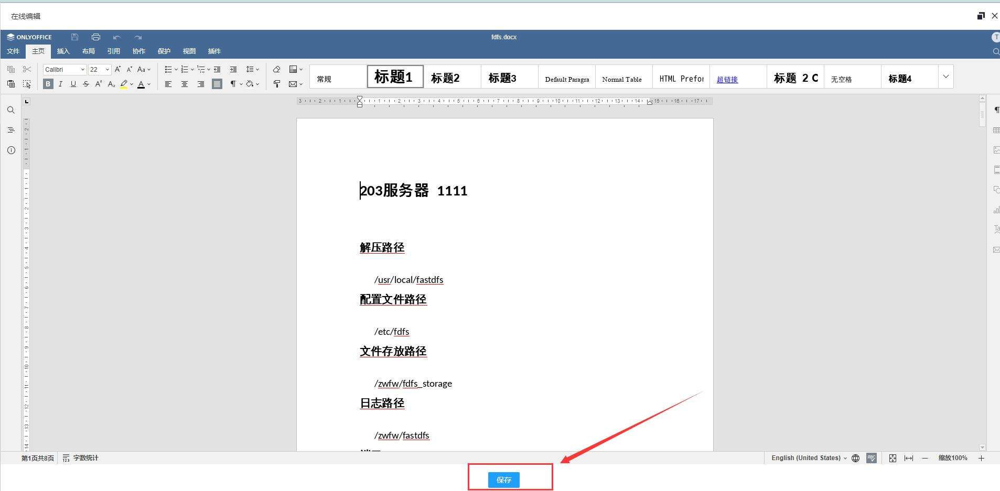

# Spring-Boot-onlyOffice（集成onlyOffice服务）

springboot集成onlyOffice的实现。在参考网络上的资料结合自身实际情况总结，让集成oo方便快捷。 封装了oo服务的API和统一了配置。
- 在线编辑，查看，转换


* onlyOffice.yml配置文件
* 如果解决了你地方问题，请给个 **star** 
-----------------------------------

### 实现和编辑的数据通信

https://blog.xenosp.cn/2023/09/09/onlyOfficePlugins/

-----------------------------------


### 编辑




### 查看




### 文件转换




快速使用
-----------------------------------

- 必须的依赖

```
<dependency>
    <groupId>org.springframework.boot</groupId>
    <artifactId>spring-boot-starter-data-redis</artifactId>
</dependency>
<dependency>
    <groupId>org.projectlombok</groupId>
    <artifactId>lombok</artifactId>
    <optional>true</optional>
</dependency>
<dependency>
    <groupId>com.alibaba</groupId>
    <artifactId>fastjson</artifactId>
    <version>2.0.25</version>
</dependency>
<dependency>
    <groupId>cn.hutool</groupId>
    <artifactId>hutool-all</artifactId>
    <version>5.8.16</version>
</dependency>
<dependency>
    <groupId>com.inversoft</groupId>
    <artifactId>prime-jwt</artifactId>
    <version>1.3.1</version>
</dependency>
<dependency>
    <groupId>org.apache.commons</groupId>
    <artifactId>commons-pool2</artifactId>
</dependency>
``` 
- 定义关键接口（oo服务回调使用）

```
1.保存接口
参考：demo/controller/IndexController.saveFile()
对应配置文件参数：oo.call-back-url
打开时访问一次
如果有保存动作，访问一次
关闭时访问一次
2.下载文件地址
参考：demo/controller/IndexController.download()
对应配置文件参数：oo.download-file
打开文件后oo服务要下载对应的文件
```
- 实现SaveFileProcessor类
```
参考：demo.service.DemoService
```

# 核心API

OnlyServiceAPI
-----------------------------------
### 1、openDocument()
```json
打开文件时，生成配置信息
{
"editorConfig": {
    "mode": "edit",
    "customization": {
        "feedback": {
            "visible": false
        },
        "help": false,
        "goback": {
            "blank": false
        },
        "macros": false,
        "autosave": false,
        "comments": false,
        "review": {},
        "hideRightMenu": true,
        "anonymous": {
            "request": false
        },
        "forcesave": true,
        "logo": {},
        "hideNotes": true
    },
    "plugins": {
        "pluginsData": [],
        "autostart": []
    },
    "callbackUrl": "http://172.31.240.1:9090/onlyOffice/save",
    "lang": "zh-CN",
    "user": {
        "name": "TongHuic7bba5",
        "id": "c7bba5"
    }
  },
"docServiceApiUrl": "http://172.31.240.1:8886/web-apps/apps/api/documents/api.js",
"documentType": "word",
"document": {
    "permissions": {
        "edit": true,
        "chat": false,
        "review": false
    },
    "title": "fdfs.docx",
    "fileType": "docx",
    "key": "63f560ec03a94654b10cd4fdeebec05a",
    "url": "http://172.31.240.1:9090/download/09cee8767dd3476280fa865bacfaf213",
    "info": {
        "sharingSettings": [{
            "isLink": true,
            "permissions": ["Full Access"],
            "user": "TongHuic7bba5"
        }],
        "created": "2023-08-05 21:38:25"
    }
},
"type": "desktop",
"token": "eyJhbGciOiJIUzI1NiIsInR5cCI6IkpXVCJ9.eyJlZGl0b3JDb25maWciOnsiY2FsbGJhY2tVcmwiOiJodHRwOi8vMTcyLjMxLjI0MC4xOjkwOTAvb25seU9mZmljZS9zYXZlIiwibGFuZyI6InpoLUNOIiwibW9kZSI6ImVkaXQiLCJ1c2VyIjp7ImlkIjoiYzdiYmE1IiwibmFtZSI6IlRvbmdIdWljN2JiYTUifSwiY3VzdG9taXphdGlvbiI6eyJhbm9ueW1vdXMiOnsicmVxdWVzdCI6ZmFsc2V9LCJhdXRvc2F2ZSI6ZmFsc2UsImNvbW1lbnRzIjpmYWxzZSwiZmVlZGJhY2siOnsidmlzaWJsZSI6ZmFsc2V9LCJmb3JjZXNhdmUiOnRydWUsImdvYmFjayI6eyJibGFuayI6ZmFsc2V9LCJoZWxwIjpmYWxzZSwiaGlkZU5vdGVzIjp0cnVlLCJoaWRlUmlnaHRNZW51Ijp0cnVlLCJsb2dvIjp7fSwibWFjcm9zIjpmYWxzZSwicmV2aWV3Ijp7fX0sInBsdWdpbnMiOnt9fSwiZG9jdW1lbnRUeXBlIjoid29yZCIsImRvY3VtZW50Ijp7ImZpbGVUeXBlIjoiZG9jeCIsInRpdGxlIjoiZmRmcy5kb2N4IiwidXJsIjoiaHR0cDovLzE3Mi4zMS4yNDAuMTo5MDkwL2Rvd25sb2FkLzA5Y2VlODc2N2RkMzQ3NjI4MGZhODY1YmFjZmFmMjEzIiwia2V5IjoiNjNmNTYwZWMwM2E5NDY1NGIxMGNkNGZkZWViZWMwNWEiLCJpbmZvIjp7ImNyZWF0ZWQiOiIyMDIzLTA4LTA1IDIxOjM4OjI1Iiwic2hhcmluZ1NldHRpbmdzIjpbeyJpc0xpbmsiOnRydWUsInBlcm1pc3Npb25zIjpbIkZ1bGwgQWNjZXNzIl0sInVzZXIiOiJUb25nSHVpYzdiYmE1In1dfSwicGVybWlzc2lvbnMiOnsiY2hhdCI6ZmFsc2UsImVkaXQiOnRydWUsInJldmlldyI6ZmFsc2V9fSwidHlwZSI6ImRlc2t0b3AifQ.HA6qS3P-czSDuScxH55tq5Bep1aN72N_F5YbXlNgJ3M"
}
```
### 2、handlerStatus()
```
保存文件过程中，执行此方法
参考：demo/controller/IndexController.saveFile()
     demo/service/FileService.documentSave()
```
### 3、save()

```
外部触发保存操作。 autosave/forcesave 这俩个参数为默认值有效
修改文件后，没有执行回调方法。在点击保存后执行回调
```
### 4、converted()
```
文件转换接口
```
# 页面集成
### html
```
参考 onlyOffice.html
style.js 中的openDocument()
```
### vue
```
参考 onlyOffice.vue
```


